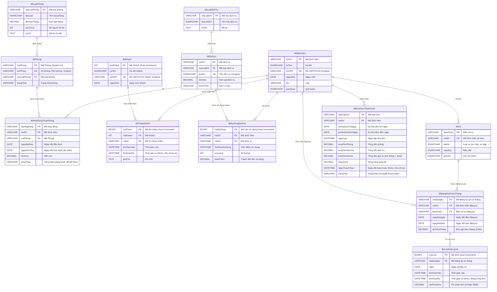

# 🏢 Hệ Thống Quản Lý Ký Túc Xá API

[](https://www.python.org/downloads/)
[](https://flask.palletsprojects.com/en/2.0.x/)
[](https://www.mysql.com/)
[](https://redis.io/)
[](LICENSE)

Hệ thống backend API RESTful toàn diện để quản lý hoạt động ký túc xá sinh viên, bao gồm thông tin sinh viên, quản lý phòng, hợp đồng, dịch vụ, gửi xe, theo dõi khách thăm và hóa đơn thanh toán.

## 📋 Mục Lục

- [Tổng quan](#tổng-quan)
- [Tính năng chính](#tính-năng-chính)
- [Công nghệ sử dụng](#công-nghệ-sử-dụng)
- [Thiết kế cơ sở dữ liệu](#thiết-kế-cơ-sở-dữ-liệu)
- [Các Endpoint API](#các-endpoint-api)
- [Hướng dẫn cài đặt](#hướng-dẫn-cài-đặt)
  - [Yêu cầu hệ thống](#yêu-cầu-hệ-thống)
  - [Các bước cài đặt](#các-bước-cài-đặt)
- [Cấu hình](#cấu-hình)
- [Chạy ứng dụng](#chạy-ứng-dụng)
- [Kiểm thử](#kiểm-thử)
- [Yêu cầu dự án](#yêu-cầu-dự-án)

## 📝 Tổng quan

Ứng dụng này cung cấp các endpoint API RESTful để thực hiện các thao tác CRUD trên các thực thể dữ liệu chính đồng thời triển khai logic nghiệp vụ phức tạp liên quan đến quản lý ký túc xá. Hệ thống tích hợp Redis để lưu đệm dữ liệu được truy cập thường xuyên, cải thiện đáng kể hiệu suất đọc. Các xác thực quy tắc nghiệp vụ (như giới hạn sức chứa phòng và giới hạn đăng ký xe của sinh viên) được triển khai ở tầng dịch vụ của ứng dụng.

## ✨ Tính năng chính

- **Quản lý sinh viên**: Các thao tác CRUD đầy đủ cho hồ sơ sinh viên
- **Quản lý loại phòng & phòng**: Cấu hình loại phòng với giá và giới hạn sức chứa
- **Quản lý hợp đồng thuê**: Tạo hợp đồng với xác thực tình trạng phòng
- **Quản lý dịch vụ**: Cấu hình loại dịch vụ và theo dõi sử dụng dịch vụ
- **Hệ thống đăng ký xe**: Đăng ký gửi xe theo tháng với giám sát sử dụng
- **Theo dõi ra/vào của xe**: Tính phí tự động dựa trên chính sách sử dụng
- **Quản lý khách thăm**: Đăng ký và theo dõi khách thăm
- **Hệ thống hóa đơn**: Tự động tạo hóa đơn hàng tháng và theo dõi thanh toán
- **Báo cáo nâng cao**: API truy vấn phức tạp cho thông tin kinh doanh
- **Tối ưu hiệu suất**: Lưu đệm Redis cho các thao tác GET

## 🛠️ Công nghệ sử dụng

- **Backend**: Python 3.8+ với framework Flask
- **Cơ sở dữ liệu**: MySQL 8.0+
- **Bộ nhớ đệm**: Redis
- **Các thư viện chính**:
  - `Flask`: Framework web
  - `mysql-connector-python`: Kết nối cơ sở dữ liệu MySQL
  - `redis`: Client Redis cho bộ nhớ đệm
  - `python-dotenv`: Quản lý biến môi trường
  - `flask-cors`: Hỗ trợ chia sẻ tài nguyên giữa các nguồn gốc khác nhau (CORS)
  - `marshmallow`: Tuần tự hóa/giải tuần tự hóa đối tượng
  - `gunicorn`: Máy chủ HTTP WSGI (cho môi trường sản xuất)

## 🗄️ Thiết kế cơ sở dữ liệu

Hệ thống sử dụng cơ sở dữ liệu quan hệ với cấu trúc thực thể sau:



### Tập lệnh thiết lập cơ sở dữ liệu

File `QuanLyKyTucXa_Setup.sql` trong kho lưu trữ này chứa tất cả các lệnh SQL cần thiết để:

- Tạo cơ sở dữ liệu `QuanLyKyTucXa`
- Tạo tất cả các bảng với khóa chính, khóa ngoại và định nghĩa ràng buộc
- Chèn dữ liệu mẫu cho mục đích kiểm thử
- Bao gồm các truy vấn SQL phức tạp cho yêu cầu báo cáo (với các chú thích rõ ràng)

## 🔌 Các Endpoint API

Ứng dụng cung cấp các endpoint API RESTful sau với tiền tố `/api`:

### Quản lý sinh viên
- `GET /api/sinhvien`: Lấy tất cả sinh viên
- `GET /api/sinhvien/{maSV}`: Lấy sinh viên theo ID
- `POST /api/sinhvien`: Tạo sinh viên mới
- `PUT /api/sinhvien/{maSV}`: Cập nhật sinh viên
- `DELETE /api/sinhvien/{maSV}`: Xóa sinh viên

### Quản lý loại phòng
- `GET /api/loaiphong`: Lấy tất cả loại phòng
- `GET /api/loaiphong/{maLoaiPhong}`: Lấy loại phòng theo ID
- `POST /api/loaiphong`: Tạo loại phòng mới
- `PUT /api/loaiphong/{maLoaiPhong}`: Cập nhật loại phòng
- `DELETE /api/loaiphong/{maLoaiPhong}`: Xóa loại phòng

### Quản lý phòng
- `GET /api/phong`: Lấy tất cả phòng
- `GET /api/phong/{maPhong}`: Lấy phòng theo ID
- `POST /api/phong`: Tạo phòng mới
- `PUT /api/phong/{maPhong}`: Cập nhật phòng
- `DELETE /api/phong/{maPhong}`: Xóa phòng

### Quản lý hợp đồng
- `GET /api/hopdong`: Lấy tất cả hợp đồng
- `GET /api/hopdong/sinhvien/{maSV}`: Lấy hợp đồng theo ID sinh viên
- `POST /api/hopdong`: Tạo hợp đồng mới
- `PUT /api/hopdong/{maHopDong}`: Cập nhật trạng thái hợp đồng

### Quản lý loại dịch vụ
- `GET /api/dichvu/loai`: Lấy tất cả loại dịch vụ
- `GET /api/dichvu/loai/{maLoaiDV}`: Lấy loại dịch vụ theo ID
- `POST /api/dichvu/loai`: Tạo loại dịch vụ mới
- `PUT /api/dichvu/loai/{maLoaiDV}`: Cập nhật loại dịch vụ
- `DELETE /api/dichvu/loai/{maLoaiDV}`: Xóa loại dịch vụ

### Quản lý dịch vụ
- `GET /api/dichvu`: Lấy tất cả dịch vụ
- `GET /api/dichvu/{maDV}`: Lấy dịch vụ theo ID
- `POST /api/dichvu`: Tạo dịch vụ mới
- `PUT /api/dichvu/{maDV}`: Cập nhật dịch vụ
- `DELETE /api/dichvu/{maDV}`: Xóa dịch vụ

### Quản lý sử dụng dịch vụ
- `GET /api/dichvu/sudung/sinhvien/{maSV}`: Lấy lịch sử sử dụng dịch vụ theo sinh viên
- `POST /api/dichvu/sudung`: Ghi nhận sử dụng dịch vụ

### Quản lý xe
- `GET /api/guixe/xe`: Lấy tất cả xe
- `GET /api/guixe/xe/sinhvien/{maSV}`: Lấy xe theo ID sinh viên
- `POST /api/guixe/xe`: Đăng ký xe mới
- `PUT /api/guixe/xe/{bienSoXe}`: Cập nhật thông tin xe
- `DELETE /api/guixe/xe/{bienSoXe}`: Xóa xe

### Đăng ký gửi xe tháng
- `GET /api/guixe/dangky`: Lấy tất cả đăng ký tháng
- `GET /api/guixe/dangky/sinhvien/{maSV}`: Lấy đăng ký theo ID sinh viên
- `POST /api/guixe/dangky`: Tạo đăng ký tháng mới
- `PUT /api/guixe/dangky/{maDangKy}`: Cập nhật đăng ký
- `DELETE /api/guixe/dangky/{maDangKy}`: Hủy đăng ký

### Quản lý ra/vào xe
- `GET /api/guixe/luot/dangky/{maDangKy}`: Lấy lịch sử ra/vào theo ID đăng ký
- `POST /api/guixe/luot`: Ghi nhận xe ra/vào

### Quản lý khách
- `GET /api/khach`: Lấy tất cả khách
- `GET /api/khach/{maKhach}`: Lấy khách theo ID
- `GET /api/khach/cmt/{soCMT}`: Tìm khách theo số CMT/CCCD
- `POST /api/khach`: Đăng ký khách mới
- `PUT /api/khach/{maKhach}`: Cập nhật thông tin khách

### Theo dõi khách thăm
- `GET /api/khach/tham/sinhvien/{maSV}`: Lấy lịch sử khách thăm theo ID sinh viên
- `POST /api/khach/tham`: Ghi nhận khách vào
- `PUT /api/khach/tham/{maTham}`: Ghi nhận khách ra

### Quản lý hóa đơn
- `GET /api/hoadon`: Lấy tất cả hóa đơn
- `GET /api/hoadon/{maHoaDon}`: Lấy chi tiết hóa đơn
- `GET /api/hoadon/sinhvien/{maSV}`: Lấy hóa đơn theo ID sinh viên
- `POST /api/hoadon/generate`: Kích hoạt tạo hóa đơn hàng tháng
- `PUT /api/hoadon/{maHoaDon}/pay`: Đánh dấu hóa đơn đã thanh toán

### API Báo cáo
- `GET /api/bao-cao/chiphi-sinhvien`: Báo cáo chi phí sinh viên
- `GET /api/bao-cao/sudung-dichvu`: Báo cáo sử dụng dịch vụ
- `GET /api/bao-cao/khach-tham`: Báo cáo thống kê khách thăm
- `GET /api/bao-cao/doanhthu-dichvu`: Báo cáo doanh thu dịch vụ

Để biết thông tin chi tiết về các tham số yêu cầu và định dạng phản hồi, tham khảo mã nguồn trong thư mục `app/routes/`.

## 🚀 Hướng dẫn cài đặt

### Yêu cầu hệ thống

- Python 3.8 trở lên
- pip và venv (thường được bao gồm trong Python)
- MySQL Server 8.0+ đang chạy
- Redis Server đang chạy

### Các bước cài đặt

1. **Sao chép kho lưu trữ**:
   ```bash
   git clone https://github.com/yourusername/dormitory-management-api.git
   cd dormitory-management-api
   ```

2. **Tạo và kích hoạt môi trường ảo**:
   ```bash
   python -m venv venv

   # Trên Linux/macOS/WSL:
   source venv/bin/activate

   # Trên Windows (Command Prompt):
   venv\Scripts\activate.bat

   # Trên Windows (PowerShell):
   .\venv\Scripts\Activate.ps1
   ```

3. **Cài đặt các phụ thuộc**:
   ```bash
   pip install -r requirements.txt
   ```

4. **Thiết lập cơ sở dữ liệu**:
   - Đảm bảo MySQL Server đang chạy
   - Tạo người dùng và cơ sở dữ liệu chuyên dụng (được khuyến nghị) hoặc sử dụng tài khoản root (chỉ dành cho phát triển)
   - Chạy tệp lệnh SQL để tạo bảng và chèn dữ liệu mẫu:
   ```bash
   # Sử dụng root (chỉ phát triển):
   mysql -u root -p < QuanLyKyTucXa_Setup.sql

   # Sử dụng người dùng chuyên dụng:
   mysql -u tên_người_dùng -p cơ_sở_dữ_liệu < QuanLyKyTucXa_Setup.sql
   ```

## ⚙️ Cấu hình

1. **Tạo tệp biến môi trường**:
   Tạo một tệp `.env` trong thư mục gốc của dự án với nội dung sau:

   ```ini
   # Cấu hình cơ sở dữ liệu
   MYSQL_HOST=localhost
   MYSQL_USER=tên_người_dùng_mysql
   MYSQL_PASSWORD=mật_khẩu_mysql
   MYSQL_DB=QuanLyKyTucXa

   # Cấu hình Redis
   REDIS_HOST=localhost
   REDIS_PORT=6379
   REDIS_DB=0

   # Cấu hình Flask
   FLASK_SECRET_KEY=khóa_bí_mật_ngẫu_nhiên_an_toàn
   FLASK_ENV=development  # Thay đổi thành 'production' cho triển khai
   ```

   **Quan trọng**: Thay thế các giá trị placeholder bằng cấu hình thực tế của bạn.

## 🏃‍♂️ Chạy ứng dụng

1. **Khởi động Redis Server** (nếu chưa chạy):
   ```bash
   # Trên Linux:
   sudo systemctl start redis-server

   # Trên macOS với Homebrew:
   brew services start redis

   # Trên Windows:
   # Khởi động Redis qua Windows Service hoặc WSL
   ```

2. **Chạy ứng dụng**:
   ```bash
   # Chế độ phát triển:
   python run.py

   # Chế độ sản xuất (sử dụng Gunicorn):
   gunicorn --workers=4 --bind 0.0.0.0:5000 "app:create_app()"
   ```

   API sẽ khả dụng tại `http://localhost:5000`.

## 🧪 Kiểm thử

Bạn có thể kiểm thử API bằng một trong các phương pháp sau:

1. **Tập lệnh kiểm thử tự động**:
   ```bash
   chmod +x test_api.sh
   ./test_api.sh
   ```

2. **Sử dụng công cụ kiểm thử API**:
   - [Postman](https://www.postman.com/)
   - [Insomnia](https://insomnia.rest/)
   - [curl](https://curl.se/) để kiểm thử qua dòng lệnh

3. **Các lệnh curl mẫu**:
   ```bash
   # Lấy tất cả sinh viên
   curl -X GET http://localhost:5000/api/sinhvien

   # Tạo sinh viên mới
   curl -X POST http://localhost:5000/api/sinhvien \
     -H "Content-Type: application/json" \
     -d '{"maSV": "SV001", "hoTen": "Nguyen Van A", "soCMT": "123456789", "ngaySinh": "2000-01-01", "lop": "K65-CNTT", "queQuan": "Ha Noi"}'
   ```

## 📄 Yêu cầu dự án

Dự án này được phát triển như một phần của Đồ án 2, đáp ứng các yêu cầu sau:

1. Thiết kế và triển khai hệ thống cơ sở dữ liệu cho ứng dụng quản lý ký túc xá sinh viên
2. Tạo dữ liệu mẫu và triển khai các truy vấn SQL phức tạp cho báo cáo
3. Phát triển API toàn diện cho tất cả các thao tác CRUD và yêu cầu nghiệp vụ
4. Triển khai xác thực logic nghiệp vụ cho giới hạn sức chứa phòng, giới hạn đăng ký xe, v.v.
5. Tạo API chuyên biệt cho các nhu cầu báo cáo sau:
   - Báo cáo chi phí sinh viên (phòng và dịch vụ)
   - Báo cáo sử dụng dịch vụ theo khoảng thời gian
   - Thống kê theo dõi khách thăm
   - Báo cáo doanh thu dịch vụ
